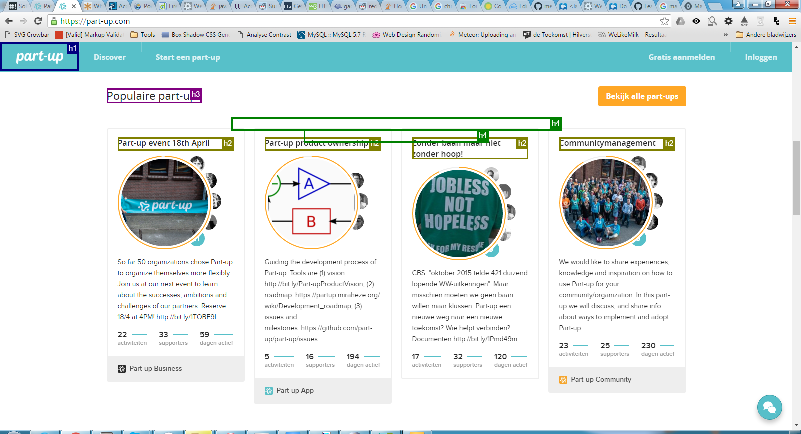
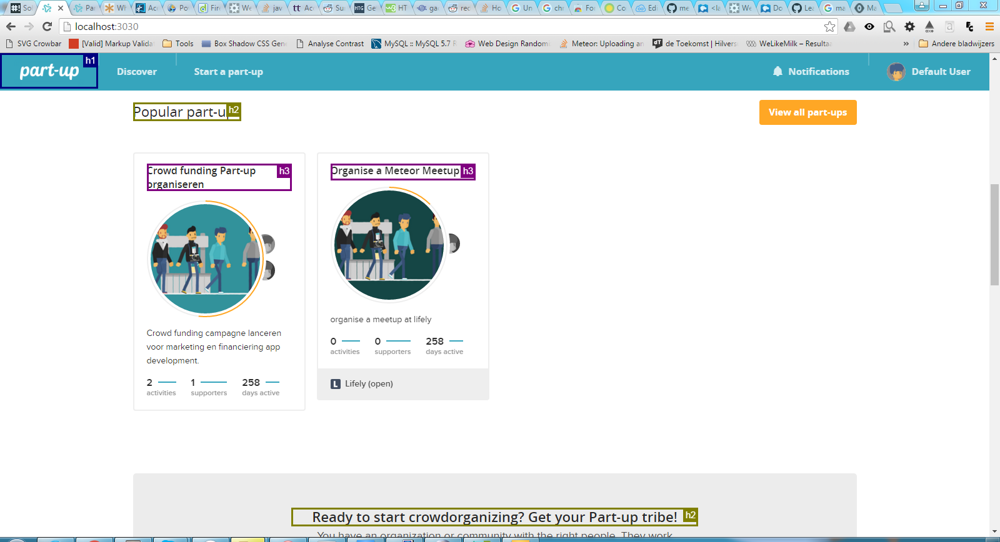
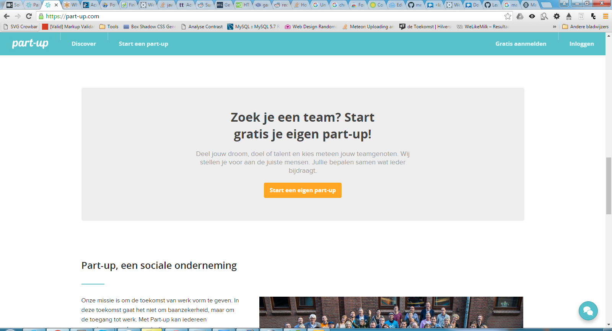
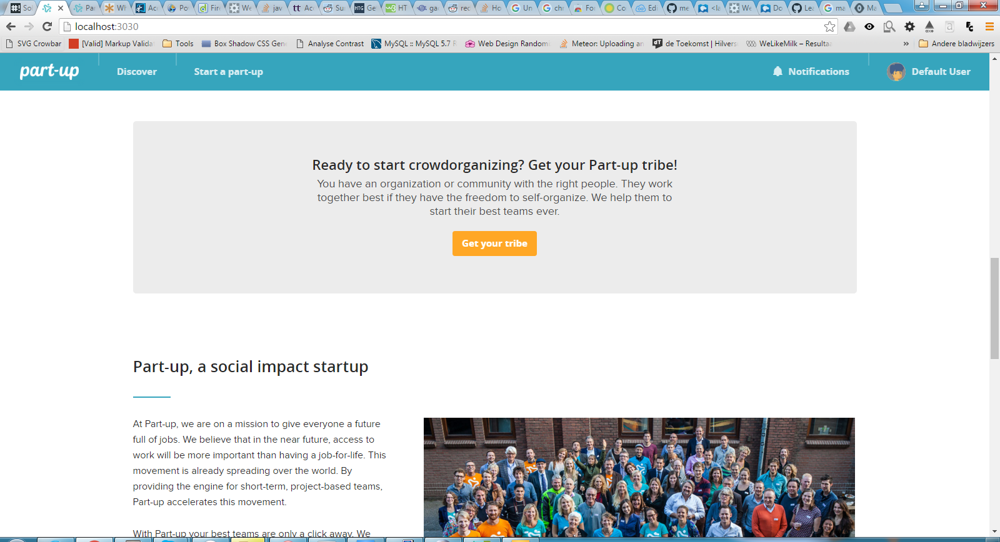

##Aanpassingen

###Alle headings op de homepagina geordend. Geen h4 met genested h2's meer. 
Voor:

Na:

###Outlines op knoppen en menu items weer zichtbaar
Dit verbeterd de user experience voor alle gebruikers die met de tab-toetsten moeten werken.

###Kleur contrast van highlight op homepagina verbeterd
Voor:

Na: 

###Dropdowns klappen open op focus
Hierdoor kan je makkelijker erdoor heen tabben. 

*Probleem:* De tabs openen nu wel, maar kunnen op dit moment alleen nog dicht dmv. klikken. Ik zou meer tijd nodig hebben om er voor te zorgen dat ze ook weer sluiten.

-----

##Aanbevelingen

###Alt tags toevoegen of invullen
Veel afbeeldingen hebben nu geen alt tags of lege alt tags. Ook bij dingen als profielafbeeldingen van gebruikers is het handig om een alt toe te voegen met, bijv. de username van de gebruiker.

###Icon fonts vervangen door afbeeldingen of inline-svg
Als de gebruiker zelf een font inlaad (bijv. mensen met dislectie), worden de icons onleesbaar. Omdit te voorkomen kunnen de fonts beter worden vervangen met inline-svgs of een gif/png. 

###Groter kleur contrast in de header
Het kleur contrast in de header is net te laag voor mensen met een beperking.

###Niet transparante .png's omzetten naar .jpg
Als er geen transparantie nodig is is het beter om jpg's te gebruiken, omdat deze lichter zijn.

###Form structuur verhindered navigatie door tabtoets

###Title attribute aanpassen aan de hand van de huidge pagina
Voor mensen met screenreaders wordt de pagina title voor gelezen als ze weer terug navigeren naar de pagina. Ipv. zoals het nu is op alle pagina's 'Part-up', zou je de page title kunnen laten veranderen naar 'Part-up Discover' op de discover pagina.

###Part-up radial heeft geen nuttige informatie voor blinde of slechtziende mensen, voeg een figcaption toe voordeze doelgroep

###Pagina structuur
Nu wordt alles in een main ingeladen, maar de main wordt gebruik voor de hoofdcontent van de pagina. Hier horen dus niet de header & footer in, als deze statisch zijn. Ik adviseer om de header & footer buiten de main in te laden. Als Meteor toch een container hiervoor nodig heeft raad ik een DIV aan. 

### Skip to content link toevoegen
Kan handig zijn op vervolg pagina's. Zo hoeft iemand met een screenreader niet weer heel de header door te luisten maar kan direct naar de content springen.

###Voor developers: structuur van sommige templates erg onduidelijk
Bijv.: Het vinden het template voor de part-up titel is erg lastig. Misschien een uitleg erbij voor de devs. waar ze de belangrijkste partial templates kunnen vinden?
